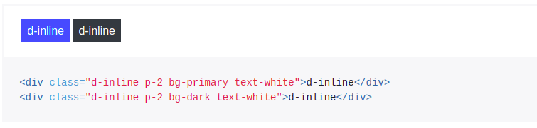
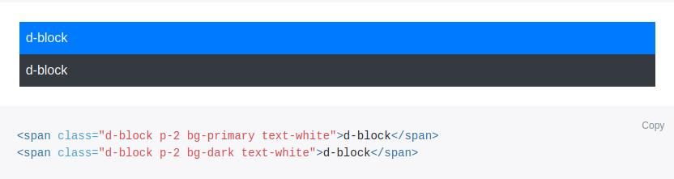
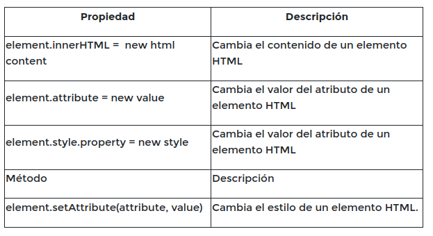
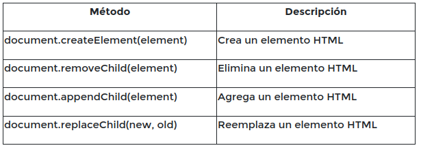

# Proyecto-AP
Prcaticas GitHub
<hr>

# Bootstrap

<hr>


<h3>BORDES<h3>

* Utiliza las clases **border,border-top,border-right,border-bottom y border-left** para agregar bordes a tus elementos.

* Utiliza las clases **border-0, border-top-0, border-right-0, border-bottom-0 y border-left-0** para remover bordes de tus elementos.

* Para mostrar una imagen dentro de un círculo utiliza la clase **rounded-circle**. Asegúrate que la imagen sea cuadrada.
 
 [Enlace](https://getbootstrap.com/docs/4.0/utilities/borders/)

<h3>ESPACIOS<h3>
 
 * Puedes utilizar clases para controlar el margin y padding de tus elementos de forma responsive.
 Las clases que controlan el margin y padding empiezan con **m** y las que controlan el padding comienzan con **p**. 
 Por defecto existen 6 tamaños para los espacios: 0 a 5 son los siguientes valores.

 * 0 - eliminar el margin o el padding.
 * 1 - 0.25rem
 * 2 - 0.5rem
 * 3 - 1rem
 * 4 - 1.5rem
 * 5 - 3rem

 Por ejemplo, para agregar un margen de 0.5rem utilizarías la clase m-2. Para un padding de 1rem utilizaríamos la clase p-3.
 También puedes aplicar el **margin o padding** a diferentes lados agregando las siguientes letras a m o p:
 
 - t - aplicar al margin o padding superior (p.e. mt-3 o pt-1).
 - b - aplicar al margin o padding inferior (p.e. mb-1 o pb-5).
 - l - margin o padding izquierdo.
 - r - margin o padding derecho.
 - x - margin o padding derecho e izquierdo.
 - y - margin o padding superior e inferior.
 
* También puedes agregar sm, md, lg y xl para controlar en qué tipos de pantalla se aplica el margin o el padding. Por ejemplo: mt-md-5 sólo agregaría el margen superior de 3rem para tablets o superior.
 
 [Enlace](https://getbootstrap.com/docs/4.0/utilities/spacing/)

<h3>DISPLAY<h3>

Puedes controlar **display** de un elemento utilizando las clases de **d-none,d-inline,d-block y d-flex** (existen otros pero estos son los mas comunes).

Tambien puedes controlar en que tipos de pantalla se aplica el display agregando **sm,md,lg,y xl.** Por ejmplo **d-md-none** aplicaria **display: none** a tabletas o pantallas mas grandes ( **lg** y **xl**).

## Ejemplo : imagen 1
d-inline



## Ejemplo : imagen 2
d-block



[Enlace](https://getbootstrap.com/docs/4.0/utilities/display/)

<h3>TEXTO<h3>

Para alinear el texto utiliza las clases **text-left, text-center, text-right y text-justify**. También 
puedes controlar en qué tipos de pantalla se aplica la alineación. Por ejemplo, **text-md-center** va a centrar el texto a tabletas o pantallas más grandes (lg y xl)

Utiliza las clases text-lowercase, **text-uppercase y text-capitalize** para transformar el texto en 
minúscula, mayúscula y capitalizado, respectivamente.

Por último, existen las clases **font-weight-bold, font-weight-normal, font-weight-light y font-italic**.

[Enlace](https://getbootstrap.com/docs/4.0/utilities/text/)

<h3>FLEXBOX<h3>

**d-flex** Para aplicar Flexbox a un elemento utiliza la clase d-flex.
**flex-row, flex-row-reverse, flex-column y flex-column-reverse** Para controlar la dirección del texto
Para controlar la propiedad **justify-content**
**justify-content-start,ustify-content-end,justify-content-center,justify-content-between** y **justify-content-around**


<hr>

# JAVASCRIPT 
<hr>

<h3>Operador condicional ternario<h3>

El operador condicional es el único operador de JavaScript que necesita tres operadores. El operador asigna uno de dos valores basado en una condición. 

La sintaxis de este operador es: condición? valor1: valor2. Si la condición es verdadera, el operador tomará el valor 1, de lo contrario tomará el valor 2. 

``var estado = (edad> = 18)? "adulto": "menor";``

<h2>Funciones y estructuras<h2>

### SWITCH:
Una sentencia switch permite a un programa evaluar una expresión e intentar igualar el valor de dicha expresión a una etiqueta de caso (case). Si se encuentra una coincidencia, el programa ejecuta la sentencia asociada. Una sentencia switch se describe como se muestra a continuación:

EJEMPLO: La función recibe un color. Devolver el string correspondiente:
  En caso que el color recibido sea "blue", devuleve --> "This is blue"
  En caso que el color recibido sea "red", devuleve --> "This is red"
  En caso que el color recibido sea "green", devuleve --> "This is green"
  En caso que el color recibido sea "orange", devuleve --> "This is orange"
  Caso default: devuelve --> "Color not found"
  Usar el statement Switch.

```
      function colors(color) {
      switch(color) {
      case "blue":
        return "This is blue";
      case "red": 
        return "This is red";
      case "green":
        return "This is green";
      case "orange":
        return "This is orange";
      default: 
      return "Color not found";
        }
      }
```   
Primero busca una cláusula case con una etiqueta que coincide con el valor de la expresión y entonces, transfiere el control a esa cláusula, ejecutando las sentencias asociadas a ella. Si no se encuentran etiquetas coincidentes, busca la cláusula opcional predeterminada y transfiere el control a esa cláusula ejecutando las sentencias asociadas. Si no se encuentra la cláusula predeterminada, el programa continúa su ejecución por la siguiente sentencia al final del switch. Por convención la cláusula por defecto es la última cláusula aunque no es necesario que sea así.

La sentencia opcional break asociada con cada cláusula case asegura que el programa finaliza la sentencia switch una vez que la sentencia asociada a la etiqueta coincidente es ejecutada y continúa la ejecución por las sentencias siguientes a la sentencia switch. Si se omite la sentencia break, el programa continúa su ejecución por la siguiente sentencia que haya en la sentencia switch.

La declaracion de una funcion consiste en:

- Un nombre.
- Una lista de parámetros o argumentos encerrados entre paréntesis.
- Conjunto de sentencias JavaScript encerradas entre llaves.
```
  function suma(x, y) {
  //"x" e "y" son números
  // Suma "x" e "y" juntos y devuelve el valor
  // Tu código:
  return (x + y);
  }
```
<h2>Estructuras repetitivas<h2>

- for
- while
- do while

## SENTENCIA FOR

Un bucle for se repite hasta que la condición especificada se evalúa como falsa. 
```
  for([expresion-inicial];[condicion];[expresion-final]){
  // codigo a ser ejecutado;
  }
```
Cuando un bucle for se ejecuta, ocurre lo siguiente: la [expresión-inicial], si existe, se ejecuta. Esta expresión habitualmente inicializa uno o más contadores del bucle, pero la sintaxis permite una expresión con cualquier grado de complejidad. Esta expresión puede también declarar variables. Se evalúa la expresión [condición]. Si el valor de condición es true, se ejecuta la sentencia del bucle. Si el valor de condición es falso, el bucle para, finaliza. Si la expresión condición es omitida, la condición es asumida como verdadera. Se ejecuta la expresión [expresión-final], si hay una, y el control vuelve a evaluar la expresión [condición].

El ejemplo a continuación muestra un ciclo que se ejecuta 10 veces e imprime por consola la expresión “Número: X” donde x va del valor 0 al 10

```
      for (let i = 0; i <= 10; i++) {
       console.log("Numero " + i);

      }


      var dias = ["lunes", "martes", "miercoles", "jueves", "viernes", "sabado"]
      for (i = 0; i <= dias.length - 1; i++) {
      console.log(dias[i]);
      }

lunes
martes
miercoles
jueves
viernes
sabado

```
## SENTENCIA WHILE (mientras)

Una sentencia while ejecuta sus sentencias mientras la condición sea como verdadera. Una sentencia while tiene el siguiente aspecto:

```
   var i = 0
   while (i <= 10) {
   console.log("esto es un while " + i);
   i++;
}

```
Si la condición cambia a falsa, la sentencia dentro del bucle deja de ejecutarse y el control pasa a la sentencia inmediatamente después del bucle. La condición se evalúa antes de que la sentencia contenida en el bucle sea ejecutada. Si la condición devuelve verdadero, la sentencia se ejecuta y la condición se comprueba de nuevo. Si la condición es como falso, se detiene la ejecución y el control pasa a la sentencia siguiente al while.

## SENTENCIA DO WHILE (hasta)

Se utiliza para repetir instrucciones un número indefinido de veces, hasta que se cumpla una condición. A diferencia de la estructura mientras (while), la estructura hasta (do while) se ejecutará al menos una vez. Ejemplo:


## BUSQUEDA EN JAVASCRIPT

Existen diferentes métodos que se pueden usar en JavaScript para buscar elementos dentro de un arreglo. El método a elegir depende del caso de uso particular, por ejemplo:

- Obtener todos los elementos del arreglo que cumplen una condición específica. (Filter)
- Obtener al menos uno de los elementos del arreglo que cumple dicha condición. (Find)
- Obtener si un valor específico es parte del arreglo (Includes).
- Obtener el índice de un valor específico (IndexOf).

<h3>Array.filter()<h3>
Podemos usar el método Array.filter() para encontrar los elementos dentro de un arreglo que cumplan con cierta condición. Por ejemplo, si queremos obtener todos los elementos de un arreglo de números que sean mayores a 10, podemos hacer lo siguiente:

## Ejemplo Nro 1: "Filtra los nros que son resto de 2"

```
    let arreglo = [1, 2, 3, 4, 5, 6, 7, 8, 9, 10, 11, 12, 13, 14];
    let resultado = arreglo.filter(x => x % 2 === 0);
    
    console.log(resultado);

```
## Ejemplo Nro 2 : "Filtra los string que son mayor a 3 en su longitud"
```
   let nombres = ["Jose", "Juan", "Manu", "Hugo", "Ana"];
   let resultado = nombres.filter(x => x.length > 3);

   console.log(resultado);

```

## Ejemplo Nro 3 : "Filtra nros mayor o igual a 10"

```
   let arreglo = [1, 2, 3, 4, 5, 6, 7, 8, 9, 10, 11, 12, 13, 14];
   let resultado = arreglo.filter(x => x >= 10);

   consol.log(resultado);

```
## Ejemplo Nro 4 : " Filtrar segun Nombre"

```
let personas = [{ Nombre: "Jose", Edad: 35 }, { Nombre: "Juan", Edad: 48 }, { Nombre: "Hugo", Edad: 38 }];
let resultado = personas.filter(x => x.Nombre === "Jose");

console.log(resultado);

```
## Ejemplo Nro 5: "Filtrar segun edad mayor 36"

```
   let personas = [{ Nombre: "Jose", Edad: 35 }, { Nombre: "Juan", Edad: 48 }, { Nombre: "Hugo", Edad: 38 }];
   let resultado = personas.filter(x => x.Edad >= 36);

   console.log(resultado);

```

<h3>Array.find()<h3>
Usamos el método Array.find() para encontrar el primer elemento que cumple cierta condición. Tal como el método anterior, toma un Callback como argumento y devuelve el primer elemento que cumpla la condición establecida. Usemos el método find en el arreglo del ejemplo anterior.

## Ejemplo Nro 1 :


```
   let personas = [{ Nombre: "Jose", Edad: 35 }, { Nombre: "Juan", Edad: 48 }, { Nombre: "Hugo", Edad: 38 }];
   let resultado = personas.find(x => x.Edad >= 36);

   console.log(resultado);

   En este caso devuelve : { Nombre: "Juan", Edad: 48 } que es el primero en l lista.


```

<h3>Array.includes()<h3>

El método includes() determina si un arreglo incluye un valor específico y devuelve verdadero o falso según corresponda. En el ejemplo anterior, si queremos revisar si 20 es uno de los elementos del arreglo, podemos hacer lo siguiente:

## Ejemplo Nro 1:

```
   let arreglo = [1, 2, 3, 4, 5, 6, 7, 8, 9, 10, 11, 12, 13, 14];
   let resultado = arreglo.includes(9);

   console.log(resultado);

```

<h1>Buedqueda de Maximos y minimos</h1>

Uno de los problemas académicos más comunes es el de la búsqueda del valor máximo o mínimo dentro de una lista. JavaScript dispone de las funciones Math.max() y Math.min() con las que es posible obtener el máximo y mínimo respectivamente de un conjunto de números, por ejemplo: 

```
    Math.max(1, 2, 3, 4, 5); // resultado esperado: 5

    Math.min(1, 2, 3, 4, 5); // resultado esperado: 1

```

## Esto es un ejemplo:

```
   let listaNumero = Math.max(2, 15, 94, 54, 46, 32); 
   console.log(listaNumero);  // resultado esperado es 94.

   let listaNumero = Math.min(2, 15, 94, 54, 46, 32);
   console.log(listaNumero); // resultado esperado es 2.

```

<h1>Busqueda secuencial</h1>
La búsqueda secuencial se define como la búsqueda en la que se compara elemento por elemento del vector/array con el valor que buscamos. Es decir, un clásico recorrido secuencial (for).

## Un ejemplo:


```
   var letras = ["a", "b", "c", "d", "e", "f"];
   function busquedaSecuencial(elemento, lista) {
    for (var x in lista) {
        if (lista[x] == elemento)
            return x;
    }
    return -1;
   }
   console.log(busquedaSecuencial("f", letras)); // Resultado seria 5 .

```
<h1>Ordenamiento </h1>
Javascript provee un método que ordena los elementos de un arreglo localmente y devuelve el arreglo ordenado Array.prototype.sort([compareFunction(a, b)]). El modo de ordenación por defecto responde a la posición del valor del string de acuerdo a su valor en el juego de caracteres Unicode. Cuando se utiliza el método sort(), los elementos se ordenarán en orden ascendente (de la A a la Z) por defecto:

## Esto es un ejemplo:
```
   let listadoNro = ["Posadas", "Obera", "Apostoles", "Concepcion", "Alem"];
   console.log(listadoNro.sort());

   // Como resultado obtenemos los siguiente:
   //[ 'Alem', 'Apostoles', 'Concepcion', 'Obera', 'posadas' ]

```
<hr>

# DOM, que es?
"El Modelo de Objetos de Documento [DOM](https://www.w3.org/2005/03/DOM3Core-es/introduccion.html) del W3C es una plataforma e interfaz de lenguaje neutro que permite a los programas y scripts acceder y actualizar dinámicamente el contenido, la estructura y el estilo de un documento"


<h3>Tipos de nodos:</h3>

- **Document:** nodo raiz del que derivan todos los demas nodos del arbol.
- **Element:** representa cada una de las etiquetas **HTML**. Se trata del unico nodo que puede contener atributos y el unico del que pueden derivar otros nodos.
- **Attr:** se define un nodo de este tipo para representar cada uno de los atributos de las etiquetas **HTML**, es decir,uno por cada par de atributo = valor.
- **Text:** nodo que contiene el texto encerrado por una etiqueta **HTML**.


**Nota:** Document representa la página web, por ende, para acceder a cualquier elemento de una web, se debe primero acceder a document.

<h3>Metodos</h3>
Los métodos son acciones que se pueden realizar a los elementos HTML mediante DOM.

* Encontrar elementos **HTML** por **ID** (**getElementById**).
* Econtrar elementos **HTML** por nombre de **ETIQUETA** (**getElementByTagName**).
* Encontrar elementos **HTML** por nombre de **CLASE** (**getElementByClassName**).
* Encontrar elementos **HTML** mediante selectores **CSS** (**querySelectorAll**).

Este ejemplo encuentra el elemento con **id="intro"**:

```
   const element = document.getElementById("intro");

```
Este ejemplo encuentra todos los **<p>** elementos:

```
   const element = document.getElementsByTagName("p");

```
Este ejemplo devuelve una lista de todos los elementos con **class="intro"**.

```
   const x = document.getElementsByClassName("intro");

```
Este ejemplo devuelve una lista de todos los elementos  **<p>** con **class="intro"**.

```
   const x = document.querySelectorAll("p.intro");

```

<h3>Elementos</h3>
Los elementos del DOM pueden ser creados, modificados o eliminados. A continuación veremos las principales acciones que se pueden realizar.

## Cambiar elementos HTML


## Agregar y eliminar elementos:


